# Credit Scoring Model


##  Overview

The Credit Scoring Model is a Machine Learning project developed as part of the **CodeAlpha Machine Learning Internship**.

The main objective of this project is to predict a customer's creditworthiness using financial and demographic information. Credit scoring helps banks and financial institutions evaluate loan applicants and reduce the risk of default.

---

## Project Objectives

- Analyze customer financial data.
- Perform Exploratory Data Analysis (EDA).
- Handle missing values and preprocess data.
- Build a Credit Risk Prediction Model.
- Evaluate model performance.
- Identify the most important factors affecting credit risk.

---

## Dataset

**Dataset Used:** German Credit Dataset

### Features

- Age
- Sex
- Job
- Housing
- Saving Accounts
- Checking Account
- Credit Amount
- Duration
- Purpose

The dataset contains financial and personal information about loan applicants and is used to predict credit risk.

---

##  Technologies Used

- Python
- Pandas
- NumPy
- Matplotlib
- Seaborn
- Scikit-Learn
- Google Colab

---

## Exploratory Data Analysis

Several visualizations were created to better understand the dataset.

### Gender Distribution

Shows the number of male and female applicants.

### Age Distribution

Analyzes the age range of customers.

### Housing Distribution

Displays customer housing status:
- Own
- Rent
- Free

### Saving Accounts Distribution

Visualizes customer saving account categories.

### Checking Account Distribution

Shows checking account status among applicants.

### Loan Purpose Distribution

Illustrates the purpose of loans requested by customers.

### Credit Amount Distribution

Analyzes requested loan amounts.

### Loan Duration Distribution

Shows the distribution of loan repayment durations.

### Correlation Heatmap

Displays relationships among variables.

---

## Data Preprocessing

### Missing Value Handling

Missing values in:

- Saving Accounts
- Checking Account

were replaced with **"Unknown"** to maintain data consistency.

### Feature Encoding

Categorical features were converted into numerical values using **Label Encoding**.

---

##  Machine Learning Model

### Algorithm Used

✅ Random Forest Classifier

Random Forest was chosen because it:

- Handles structured data effectively.
- Reduces overfitting.
- Provides feature importance analysis.
- Delivers strong classification performance.

---

##  Workflow

```text
Dataset Loading
        ↓
Data Cleaning
        ↓
EDA & Visualization
        ↓
Missing Value Handling
        ↓
Feature Encoding
        ↓
Train-Test Split
        ↓
Random Forest Training
        ↓
Prediction
        ↓
Model Evaluation
        ↓
Feature Importance Analysis
```

---

##  Model Evaluation

The model was evaluated using:

- Accuracy Score
- Confusion Matrix
- Classification Report
- Feature Importance Analysis

### Confusion Matrix

The confusion matrix was generated to visualize prediction performance.

### Classification Report

Used metrics:

- Precision
- Recall
- F1-Score

---

##  Feature Importance

The most influential features identified by the model were:

1. Credit Amount
2. Duration
3. Age
4. Purpose
5. Job

These factors contributed most to credit risk prediction.

---

## Project Visualizations

## Age Distribution

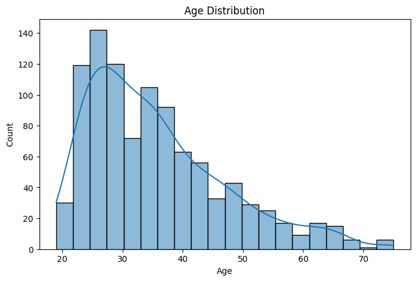

## Gender Distribution

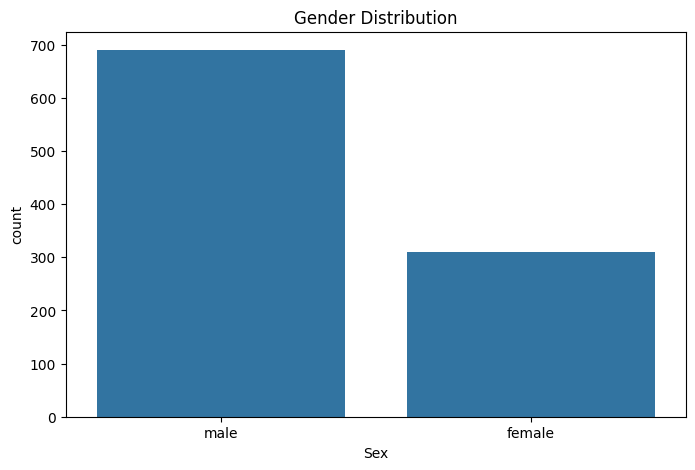

## Housing Distribution

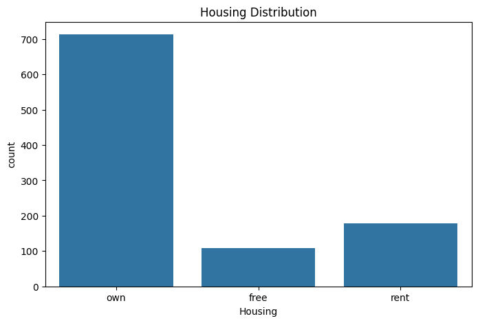

## Credit Amount Distribution

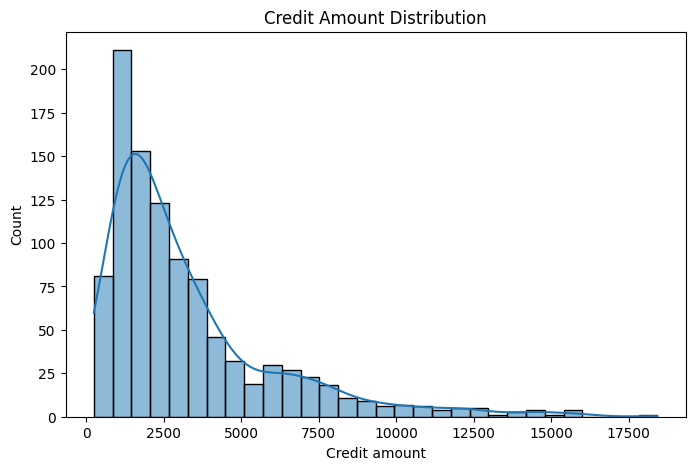

## Correlation Heatmap

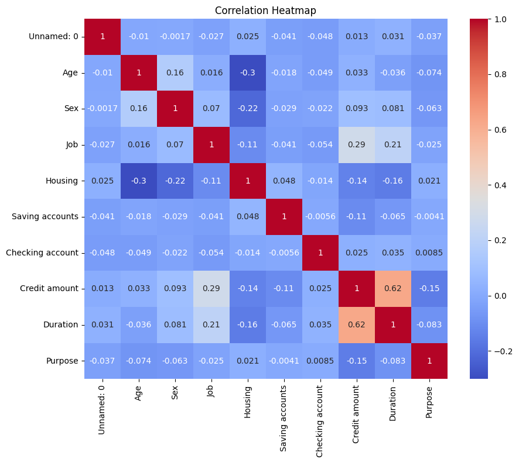

## Confusion Matrix

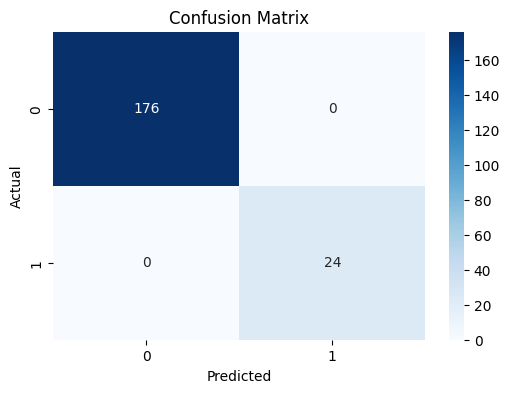

## Feature Importance

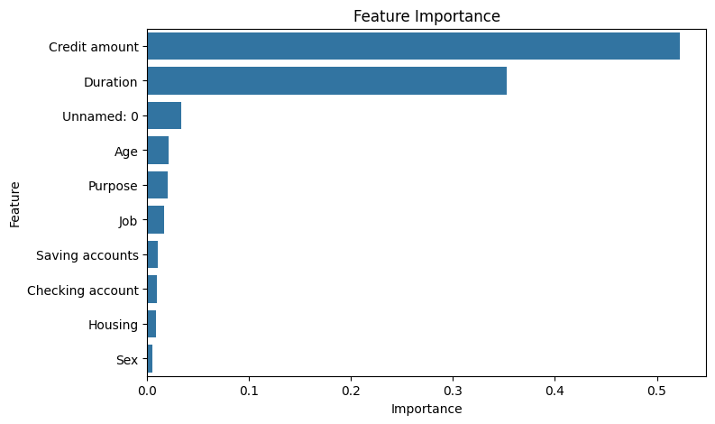

## Loan Duration Distribution

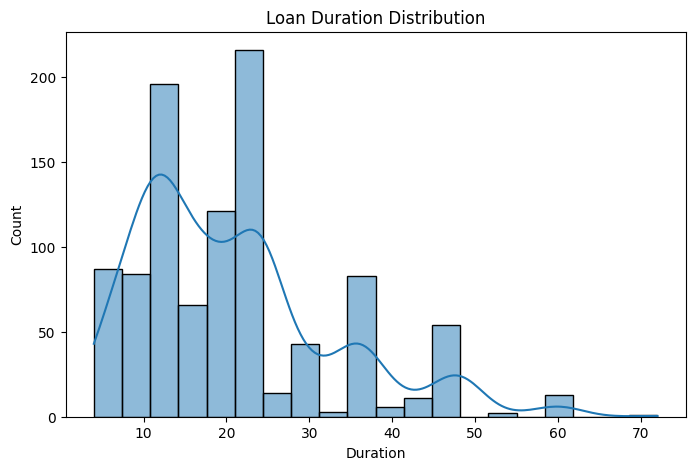

## Loan Purpose Distribution

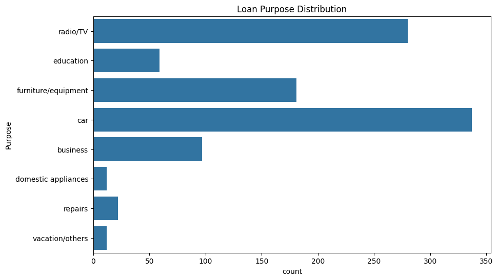

## Saving Accounts Distribution

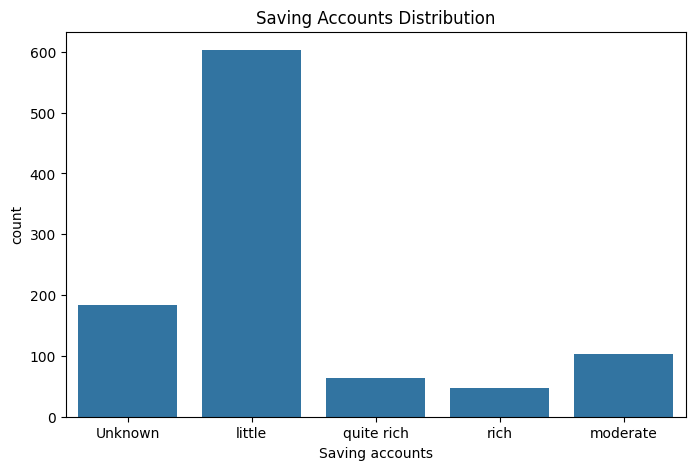

## Checking Accounts Distribution

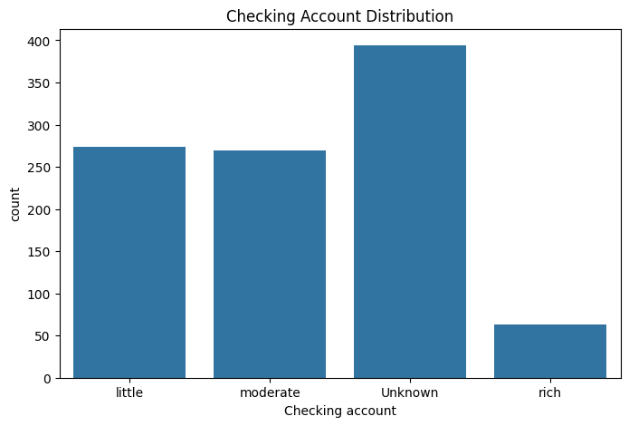

## Missing Value Heatmap

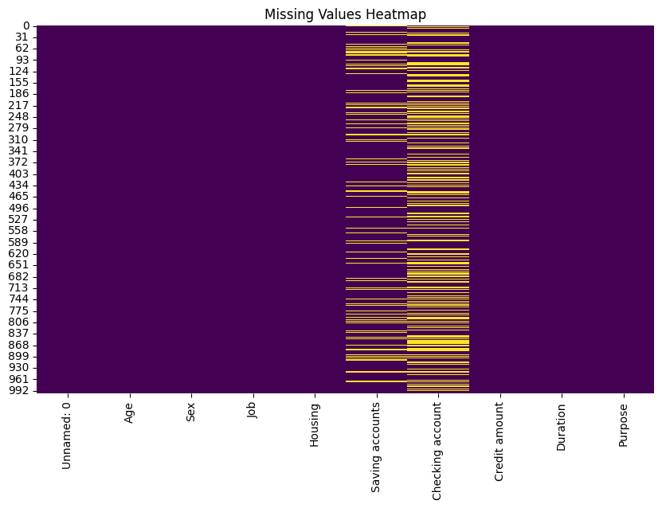

## Age Distribution by Gender

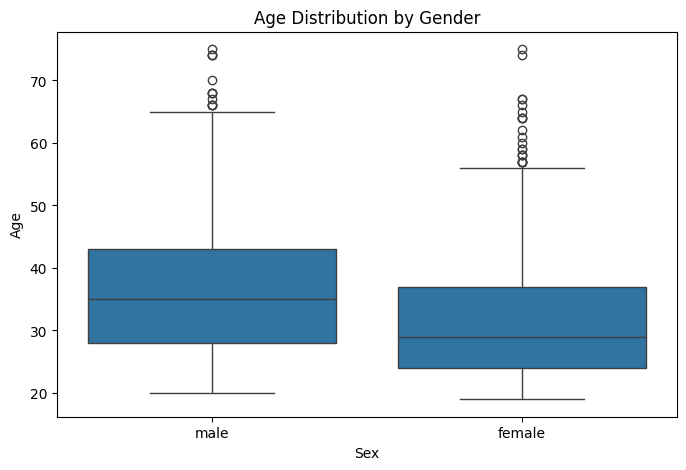

---

## Project Structure

```text
Credit-Scoring-Model/
│
├── dataset/
│   └── german_credit_data.csv
│
├── images/
│   ├── age_distribution.png
│   ├── gender_distribution.png
│   ├── housing_distribution.png
│   ├── credit_amount_distribution.png
│   ├── correlation_heatmap.png
│   ├── confusion_matrix.png
│   └── feature_importance.png
│
├── Credit_Scoring_Model.ipynb
├── credit_scoring_model.py
├── README.md
└── requirements.txt
```

---

## Key Insights

- Credit Amount and Loan Duration were the strongest indicators of risk.
- Larger loans with longer repayment periods tended to have higher risk.
- Random Forest successfully identified high-risk applicants.
- Feature importance analysis highlighted critical decision-making factors.

---

## Future Improvements

- Compare multiple algorithms (Logistic Regression, XGBoost, SVM).
- Hyperparameter tuning.
- Deploy the model using Flask or Streamlit.
- Integrate real-time credit assessment.

---

## Author

**Radhika**

Machine Learning Intern @ CodeAlpha

### Connect With Me

- LinkedIn: www.linkedin.com/in/radhika-mahapatra
- GitHub: github.com/RadhikaMahapatra

---

⭐ If you found this project useful, don't forget to star the repository.
