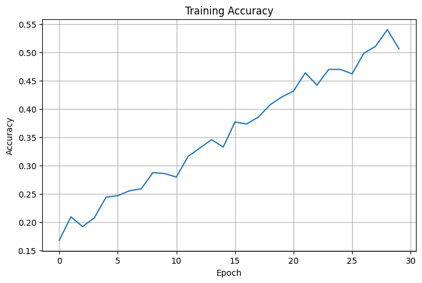
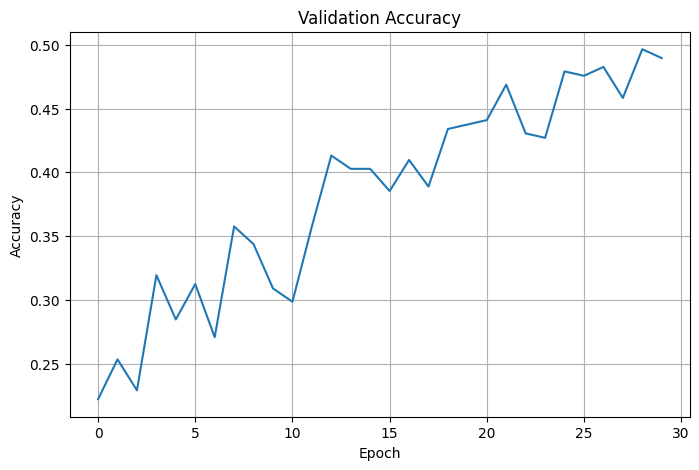
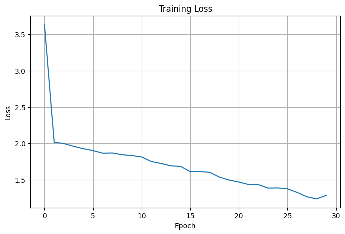
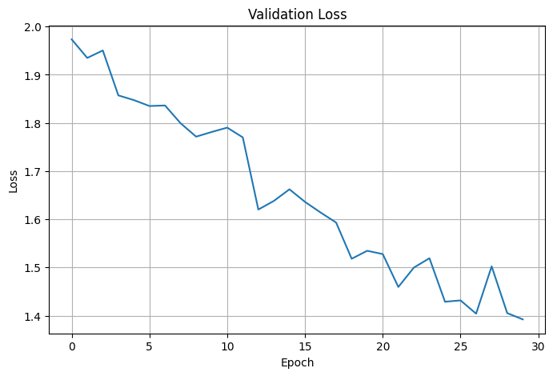

# Emotion Recognition from Speech

## Project Overview

This project focuses on recognizing human emotions from speech audio using Deep Learning and Speech Signal Processing techniques. The model analyzes speech recordings and classifies them into different emotional categories such as Happy, Sad, Angry, Fearful, Neutral, and Calm.

Emotion recognition from speech has applications in Human-Computer Interaction, Virtual Assistants, Call Center Analytics, Mental Health Monitoring, and Smart Communication Systems.

---

## Objective

The objective of this project is to develop a Speech Emotion Recognition (SER) system capable of identifying emotions from audio recordings using extracted acoustic features and deep learning models.

---

## Dataset

The project uses the RAVDESS (Ryerson Audio-Visual Database of Emotional Speech and Song) dataset.

Dataset Features:

- Professional speech recordings
- Multiple emotional categories
- High-quality audio samples
- Balanced emotion distribution

Emotion Classes:

- Neutral
- Calm
- Happy
- Sad
- Angry
- Fearful
- Disgust
- Surprised

---

## Technologies Used

- Python
- NumPy
- Pandas
- Matplotlib
- Librosa
- TensorFlow / Keras
- Scikit-Learn

---

## Project Workflow

### 1. Data Collection

Speech audio files are collected from the RAVDESS dataset.

### 2. Audio Preprocessing

Audio files are loaded and processed using Librosa.

Preprocessing steps:

- Audio loading
- Noise reduction
- Normalization
- Feature extraction

### 3. Feature Extraction

Mel-Frequency Cepstral Coefficients (MFCCs) are extracted from each audio sample.

Features used:

- MFCC
- Chroma Features
- Mel Spectrogram
- Spectral Contrast
- Tonnetz

### 4. Data Preparation

- Label Encoding
- Train-Test Split
- Feature Scaling

### 5. Model Development

A Deep Learning Neural Network is trained on the extracted features.

Model Architecture:

- Input Layer
- Dense Layers
- Dropout Layers
- Output Softmax Layer

### 6. Model Evaluation

The model performance is evaluated using:

- Accuracy
- Loss
- Confusion Matrix
- Classification Report

---

## Results

The model successfully learns emotional patterns from speech recordings and achieves reliable classification performance on unseen data.

### Training Accuracy



### Validation Accuracy



### Training Loss



### Validation Loss



---

## Performance Metrics

Metrics used for evaluation:

- Accuracy Score
- Precision
- Recall
- F1-Score
- Confusion Matrix

---

## Project Structure

```text
Task2_Emotion_Recognition/
│
├── emotion_recognition.py
├── README.md
├── training_accuracy.png
├── validation_accuracy.png
├── training_loss.png
├── validation_loss.png
├── dataset/
│   └── audio_files
│
└── model/
    └── emotion_model.h5
