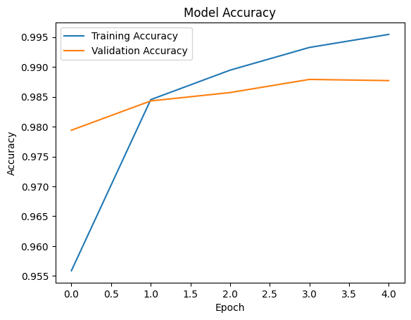
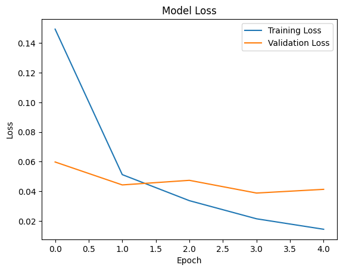
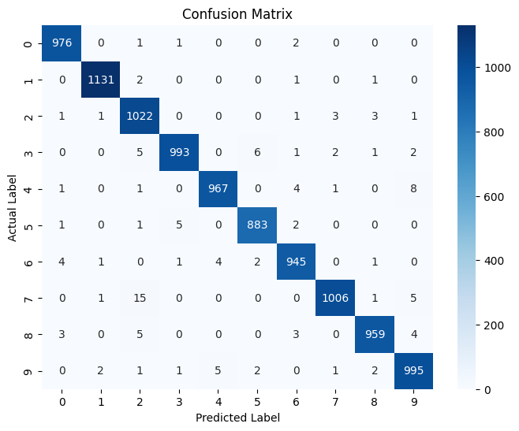
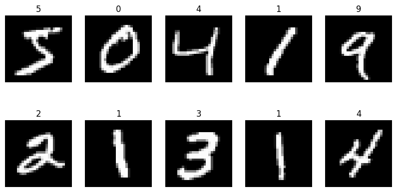

# Handwritten Character Recognition using CNN

## Project Overview

This project implements a Handwritten Character Recognition system using a Convolutional Neural Network (CNN). The model is trained on the MNIST dataset to automatically recognize handwritten digits from 0 to 9 with high accuracy.

Handwritten Character Recognition is an important application of Deep Learning and Computer Vision, widely used in Optical Character Recognition (OCR), document digitization, postal code recognition, cheque processing, and educational systems.

---

## Objective

The objective of this project is to develop a Deep Learning model capable of accurately classifying handwritten digits by learning visual patterns from image data.

---

## Dataset

The project uses the MNIST Handwritten Digits Dataset.

Dataset Information:

- 70,000 grayscale images
- Image size: 28 × 28 pixels
- 60,000 training images
- 10,000 testing images
- 10 digit classes (0–9)

Each image contains a handwritten digit represented as pixel values.

---

## Technologies Used

- Python
- NumPy
- Pandas
- Matplotlib
- Seaborn
- TensorFlow
- Keras
- Scikit-Learn

---

## Project Workflow

### 1. Dataset Loading

The MNIST dataset is loaded directly from TensorFlow/Keras datasets.

### 2. Data Visualization

Sample handwritten digit images are displayed to understand the dataset structure.

### 3. Data Preprocessing

Preprocessing steps include:

- Pixel normalization (0–1 range)
- Reshaping images to CNN input format
- One-hot encoding of labels

### 4. CNN Model Development

The Convolutional Neural Network architecture consists of:

- Convolution Layer (Conv2D)
- Max Pooling Layer
- Flatten Layer
- Dense Hidden Layer
- Output Layer (Softmax)

### 5. Model Training

The CNN model is trained using:

- Optimizer: Adam
- Loss Function: Categorical Crossentropy
- Epochs: 5

### 6. Model Evaluation

The trained model is evaluated using:

- Accuracy Score
- Loss Score
- Confusion Matrix
- Sample Predictions

---

## Results

The CNN model achieved excellent classification performance on the MNIST dataset.

### Key Results

| Metric | Value |
|----------|----------|
| Test Accuracy | 98.77% |
| Test Loss | 0.0413 |
| Training Accuracy | Above 99% |
| Validation Accuracy | Around 98% |

---

## Training and Validation Accuracy



The graph shows consistent improvement in training and validation accuracy across epochs, indicating effective learning and strong generalization performance.

---

## Training and Validation Loss



The loss curves decrease steadily during training, demonstrating successful optimization of the CNN model.

---

## Confusion Matrix



The confusion matrix illustrates model predictions for each digit class. Most values are concentrated along the diagonal, indicating highly accurate classifications.

---

## Sample Predictions



The model successfully predicts handwritten digits from unseen test images, demonstrating its ability to generalize to new data.

---

## Performance Analysis

Key observations:

- High classification accuracy achieved.
- Very low prediction error.
- Minimal overfitting observed.
- Strong performance across all digit classes.
- Effective feature extraction through convolutional layers.

---

## Advantages of CNN

- Automatic feature extraction.
- Reduced need for manual feature engineering.
- High image classification accuracy.
- Robust performance on handwritten data.
- Efficient learning of spatial features.

---

## Applications

- Optical Character Recognition (OCR)
- Bank Cheque Processing
- Postal Code Recognition
- Document Digitization
- Educational Assessment Systems
- License Plate Recognition
- Automated Form Processing

---

## Project Structure

```text
Task3_Handwritten_Character_Recognition/
│
├── code_alpha_task3_handwritten_character_recognition.py
├── Code_Alpha_Task3_Handwritten_Character_Recognition.ipynb
├── README.md
├── accuracy.png
├── loss.png
├── confusion_matrix.png
├── sample.png
└── model/
