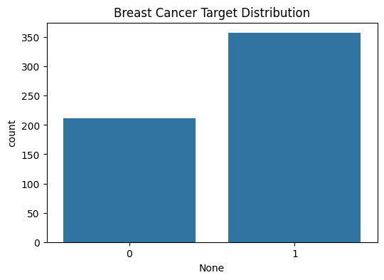
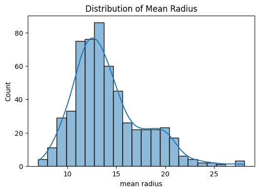
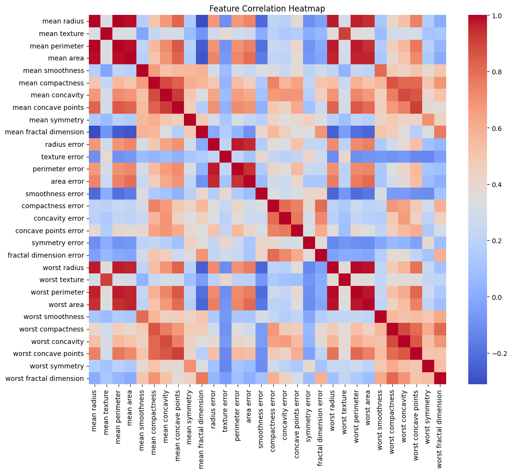

# Disease Prediction from Medical Data

## CodeAlpha Machine Learning Internship - Task 4

A Machine Learning project that predicts breast cancer diagnosis using medical data. The model classifies tumors as **Malignant (Cancerous)** or **Benign (Non-Cancerous)** using diagnostic features from the Breast Cancer Wisconsin Dataset.

---

## Project Objective

The objective of this project is to develop a disease prediction system capable of identifying breast cancer cases using machine learning techniques. The system assists in early disease detection and supports healthcare decision-making through predictive analytics.

---

## Dataset Information

**Dataset:** Breast Cancer Wisconsin Dataset

### Target Classes

| Value | Class |
|---------|---------|
| 0 | Malignant (Cancerous) |
| 1 | Benign (Non-Cancerous) |

The dataset contains multiple medical features extracted from breast tumor images and is commonly used for classification tasks.

---

## Technologies Used

- Python
- NumPy
- Pandas
- Matplotlib
- Seaborn
- Scikit-Learn
- Google Colab

---

## Machine Learning Algorithms

### Logistic Regression
A supervised learning algorithm widely used for binary classification problems.

### Random Forest Classifier
An ensemble learning algorithm that combines multiple decision trees to improve prediction accuracy and reduce overfitting.

---

## Project Workflow

### 1. Data Collection
- Load Breast Cancer Wisconsin Dataset

### 2. Data Exploration
- Dataset Overview
- Statistical Analysis
- Missing Value Detection

### 3. Data Visualization
- Target Distribution
- Feature Correlation Heatmap
- Mean Radius Distribution
- Confusion Matrix

### 4. Data Preprocessing
- Feature Scaling using StandardScaler
- Train-Test Split

### 5. Model Development
- Logistic Regression
- Random Forest Classifier

### 6. Model Evaluation
- Accuracy Score
- Precision
- Recall
- F1-Score
- Confusion Matrix

### 7. Model Comparison
- Compare algorithm performance
- Select best-performing model

---

## Project Structure

```text
Task4_Disease_Prediction_from_Medical_Data/
│
├── code_alpha_task4_disease_prediction_from_medical_data_.py
├── Code_Alpha_Task4_Disease_Prediction_from_Medical_Data_.ipynb
├── breast_cancer_target_distribution.png
├── distribution_mean_radius.png
├── feature_correaltion_heatmap.png
├── confusion_matrix(3).png
└── README.md
```

---

## Exploratory Data Analysis

### Breast Cancer Target Distribution



Shows the distribution of malignant and benign breast cancer cases.

---

### Distribution of Mean Radius



Displays the distribution of one of the important medical features.

---

### Feature Correlation Heatmap



Illustrates relationships among medical features and highlights strongly correlated variables.

---

### Confusion Matrix

.png)

Evaluates classification performance by comparing actual and predicted labels.

---

## Model Performance

### Random Forest Classifier

| Metric | Score |
|----------|----------|
| Accuracy | 96.5% |
| Precision | High |
| Recall | High |
| F1-Score | High |

Random Forest achieved the best performance among the tested machine learning models.

---

## Key Findings

- Strong correlations exist among several medical features.
- Feature scaling improved model performance.
- Random Forest outperformed Logistic Regression.
- The model successfully classified malignant and benign tumors.
- Machine learning can assist healthcare professionals in early disease detection.

---

## Conclusion

This project successfully developed a Disease Prediction System using machine learning techniques. Data preprocessing, visualization, feature engineering, and classification models were implemented to predict breast cancer diagnoses. Among the evaluated models, Random Forest delivered the highest accuracy of approximately **96.5%**, demonstrating the effectiveness of machine learning in healthcare applications.

---

## References

1. Breast Cancer Wisconsin Dataset
2. Scikit-Learn Documentation
3. NumPy Documentation
4. Pandas Documentation
5. Matplotlib Documentation
6. Seaborn Documentation
7. UCI Machine Learning Repository
